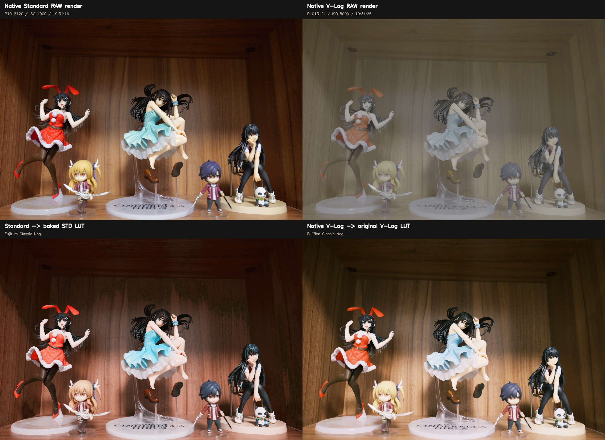

# 🧪 V-Log Alchemy (Lumix Body Snatcher)

[English](README.md) | [简体中文](README_zh-CN.md)

> **Turn your Panasonic Lumix camera into a Fujifilm GFX, Leica, Hasselblad Phocus, ARRI, and more using precise color science reverse engineering.**

---

## 🔗 Related Projects

### Raw-Alchemy
**[Raw-Alchemy](https://github.com/shenmintao/Raw-Alchemy)** - A specialized tool for applying LUTs to RAW images.

If you want to apply these cinematic LUTs directly to your RAW photos (DNG, CR2, ARW, etc.) without going through video editing software, check out Raw-Alchemy. It's designed specifically for processing RAW images with LUT transformations while preserving maximum image quality.

---

## 📖 Introduction

This project aims to break the "color barrier" between camera brands through mathematical means.

Many camera manufacturers (like Fujifilm, Leica, and Hasselblad) have distinctive color science, but their official LUTs and rendering pipelines typically only accept input from their own cameras. This project reverse-engineers these paths using the **ACES (Academy Color Encoding System)** workflow and recovered vendor rendering behavior:

1.  Convert Panasonic **V-Log/V-Gamut** to the standard **ACES AP0 (Linear)**.
2.  Use custom-written **DCTL (DaVinci Color Transform Language)** or high-precision matrices to perform the **inverse operation** of the target camera's IDT (Input Device Transform).
3.  Disguise the signal as the target camera's native Log/Gamut or recovered internal RGB space (e.g., F-Log2C, Leica Log, Hasselblad RGB).
4.  Apply the target manufacturer's official color LUT or the recovered rendering transform.

The resulting `.cube` files can be directly loaded into Panasonic cameras (like S1R II, S1H, S5 series) for real-time in-camera monitoring or used in post-production.

---

## 📂 LUT Pack Content

The original creative LUTs in this repository are designed for **Panasonic V-Log / V-Gamut** input. v1.3 adds model-specific Panasonic Standard input adapters.

### Panasonic Standard Input (v1.3)

`Luts/Panasonic-Standard/Conversion` contains 33-point `Standard -> V-Log` adapters for GH6, S5II/S5IIX, G9II, GH7, S9, S1IIE, S1RII, S1II, and DC-L10.

On dual-LUT cameras, configure My Photo Style as:

```text
LUT1 = matching model *S2V.cube (Standard base)
LUT2 = an original V-Log creative LUT from this repository
```

Panasonic applies the pair as `LUT2(LUT1(image))`. Start with both opacities at 100%; lower only LUT2 to soften the look. For a single-LUT workflow, `Tools/merge_standard_luts.py` converts one or two V-Log LUTs into model-specific Standard versions. Every generated file places `#LUMIXPHOTOSTYLE STD` immediately after `TITLE`.

See [`Luts/Panasonic-Standard/README.md`](Luts/Panasonic-Standard/README.md) for model and firmware support, dual-LUT setup, derivation details, and the Standard highlight/gamut limits that cannot be recovered.

### 🗻 Fujifilm GFX Series (F-Log2C Core)
*Based on Fujifilm's medium format color science, a perfect match for high-resolution cameras like the S1R II.*

*   **`FLog2C_to_REALA-ACE_VLog.cube`**
    *   **Style**: Reala Ace (debuted with GFX100 II).
    *   **Features**: Extremely accurate color reproduction, sharp and clear. Ideal for landscapes, architecture, and high-resolution work.
*   **`FLog2C_to_CLASSIC-CHROME_VLog.cube`**
    *   **Style**: Classic Chrome.
    *   **Features**: Low saturation, high contrast, mimicking the style of old documentary magazines.
*   **`FLog2C_to_CLASSIC-Neg._VLog.cube`**
    *   **Style**: Classic Neg.
    *   **Features**: The ultimate street photography look. High contrast with warm red-orange tones, emphasizing a hard-edged look.
*   **`FLog2C_to_PROVIA_VLog.cube`**
    *   **Style**: Provia (Standard).
    *   **Features**: Standard, versatile, with natural skin tones.
*   **`FLog2C_to_Velvia_VLog.cube`**
    *   **Style**: Velvia (Vivid).
    *   **Features**: Extremely high saturation, specialized for landscapes.
*   **`FLog2C_to_ASTIA_VLog.cube`**
    *   **Style**: Astia (Soft).
    *   **Features**: Soft skin tone rendering, suitable for portraits.
*   **`FLog2C_to_ETERNA_VLog.cube`**
    *   **Style**: Eterna (Cinema).
    *   **Features**: Ultra-low contrast with a soft highlight roll-off, perfect as a video base layer.
*   **`FLog2C_to_ETERNA-BB_VLog.cube`**
    *   **Style**: Eterna Bleach Bypass.
    *   **Features**: Low saturation, extremely high contrast, with a cool, metallic feel.
*   **`FLog2C_to_PRO-Neg.Std_VLog.cube`**
    *   **Style**: Pro Neg. Std.
    *   **Features**: The standard for studio portraits, delivering fine and smooth tones.
*   **`FLog2C_to_ACROS_VLog.cube`**
    *   **Style**: Acros.
    *   **Features**: A high-texture black and white mode with a unique mid-gray tonality.

### 🔧 Technical
*   **`FLog2C_to_FLog2C-709_VLog.cube`**
    *   **Style**: Rec.709 Tech Transform.
    *   **Features**: A pure technical conversion from F-Log2C to standard Rec.709 without any film styling.
*   **`FLog2C_to_WDR_VLog.cube`**
    *   **Style**: Wide Dynamic Range.
    *   **Features**: Fujifilm's characteristic curve for video out-of-camera. Retains more highlight and shadow detail than standard Rec.709, with moderate contrast and natural colors. Ideal for quick turnarounds or live streaming.

---

### 🔴 Leica (L-Log Core)
*Based on the color science of the Leica SL/Q series, delivering the distinctively rich 'Leica look'.*

*   **`L-Log_to_Classic_VLog.cube`**
    *   **Style**: Leica Classic.
    *   **Features**: The signature 'Leica look'. High micro-contrast, deep blacks, sharp and slightly cool shadows, with warm highlights. Excellent for B&W preview or high-texture documentary photography.
*   **`L-Log_to_Natural_VLog.cube`**
    *   **Style**: Leica Natural.
    *   **Features**: More modern and neutral compared to Classic. Retains Leica's highlight roll-off but with more shadow detail, milder contrast, and exceptionally smooth, 'premium' color transitions. Suitable for fashion, portraits, or daily shooting.

---

### 🟧 Hasselblad Phocus (Phocus X2D Core)
*Based on the recovered Phocus 4.0.1 X2D rendering path including the daylight color-correction stage, described against Hasselblad's Natural Colour Solution (HNCS) reference. Updated in v1.2.*

*   **`Luts/Hasselblad/Hasselblad_Standard_Phocus_X2D_VLog.cube`**
    *   **Style**: Hasselblad Standard.
    *   **Features**: V-Log/V-Gamut mapped through Hasselblad RGB, the captured daylight Phocus `ColorCorrect` CbCr stage for true Hasselblad colour separation, a highlight rolloff, and the Phocus Standard film curve for natural, true-to-life tone, smooth transitions, restrained but rich saturation, and film-like contrast.
*   **`Luts/Hasselblad/Hasselblad_Nature_Phocus_X2D_VLog.cube`**
    *   **Style**: Hasselblad Nature.
    *   **Features**: The same Standard foundation with the captured Phocus Nature RGB gradation table. It keeps the HNCS emphasis on smooth transitions and believable colour, while adding a slightly fuller tone response for outdoor colour and saturated scenes.
*   **65-point versions** are also included for higher-precision post workflows: `Hasselblad_Standard_Phocus_X2D_VLog_65.cube` and `Hasselblad_Nature_Phocus_X2D_VLog_65.cube`.
*   **Daylight-baked**: the Phocus `ColorCorrect` / CbCr stage changes with white balance. The published LUTs and bundled artifact use the daylight table, which also covers the cloudy/shade range. Tungsten and warm captures are not bundled; a separately prepared artifact bundle can be selected with `--artifact`.
*   **Output contract**: the four published files preserve the original Hasselblad RGB/D50 film-curve output for backward compatibility. The self-contained generator can instead emit complete Rec.709 or sRGB display transforms with `--output-space rec709` or `--output-space srgb`; those variants need no following CST. Do not interpret the Hasselblad RGB output as ACES AP1.
*   **Not emitted**: `Portrait` and `Product`, because their captured color transform matches `Standard`; their Phocus preset differences are sharpening/noise behavior that a 3D LUT cannot encode.

Style reference: [Hasselblad Natural Colour Solution](https://www.hasselblad.com/learn/hasselblad-natural-colour-solution/). See [`Luts/Hasselblad/README.md`](Luts/Hasselblad/README.md) for the recovered pipeline.

---

### 📷 Nikon (N-Log Core)
*Based on Nikon's N-Log color science, providing a versatile starting point for color grading.*

*   **`N-Log_BT2020_to_REC709_BT1886_VLog.cube`**
    *   **Style**: Nikon Official Rec.709.
    *   **Features**: Nikon's standard conversion from N-Log to Rec.709, offering a neutral and accurate color representation.
*   **`RED_Achromic_Rec2020_N-Log_to_Rec709_VLog.cube`**
    *   **Style**: RED Achromic.
    *   **Features**: Transforms footage with a low-contrast monochrome look. Ideal for creating a soft, artistic feel that’s rich with detail.
*   **`RED_FilmBias_Rec2020_N-Log_to_Rec709_BT1886_VLog.cube`**
    *   **Style**: RED Film Bias.
    *   **Features**: Adds the golden warmth and hues of traditional film. A starting point for an organic, cinematic feel that enhances skin tones.
*   **`RED_FilmBiasBleachBypass_Rec2020_N-Log_to_Rec709_BT1886_VLog.cube`**
    *   **Style**: RED Film Bias Bleach Bypass.
    *   **Features**: Emulates the high contrast and desaturated colors of bleach bypass film processing. Provides a dramatic, faded look that imparts a harsh realism.
*   **`RED_FilmBiasOffset_Rec2020_N-Log_to_Rec709_BT1886_VLog.cube`**
    *   **Style**: RED Film Bias Offset.
    *   **Features**: Recreates a vintage film look with unique split-tone offsets and subtle warmth. Ideal for artistic scenes and landscapes.

---

### 🎬 ARRI (LogC Core)
*Based on the color science of the ARRI Alexa, providing the industry-standard cinematic feel.*

*   **`ARRI_LogC2Video_Classic709_VLog.cube`**
    *   **Style**: ARRI Classic 709.
    *   **Features**: The classic ARRI Rec.709 look, used in countless films and TV shows. Features true-to-life colors, excellent skin tone reproduction, and a natural highlight roll-off.

---

### 🎞️ Film Emulation (Cineon Core)
*Based on the Kodak Cineon scanning system, emulating the colors of classic motion picture film.*

*   **`Cineon_to_Fuji_3513DI_D65_VLog.cube`**
    *   **Style**: Fuji 3513DI Print Film.
    *   **Features**: Emulates the look of Fujifilm motion picture print stock, with its signature cyans and soft contrast.
*   **`Cineon_to_Kodak_2383_D65_VLog.cube`**
    *   **Style**: Kodak 2383 Print Film.
    *   **Features**: Emulates the look of Kodak motion picture print stock, the standard for Hollywood blockbusters, featuring warm colors and higher contrast.

---

### 🎥 RED Digital Cinema (RED IPP2 Core)
*Based on the IPP2 image processing pipeline from RED Digital Cinema cameras.*

*   **`REC709_MEDIUM_CONTRAST_Soft_VLog.cube`**
    *   **Style**: RED IPP2 Medium Contrast / Soft Highlight.
    *   **Features**: One of RED's official Rec.709 conversions, offering medium contrast with a soft highlight roll-off, suitable for a wide range of scenes.

---

## 📺 Community Showcase

Check out this amazing side-by-side comparison (Fuji X100V vs. Lumix S5IIX) using **V-Log Alchemy**.

Special thanks to **Josef** from **[DIE LICHTFÆNGER ACADEMY](https://www.youtube.com/@dielichtfaenger_academy)** for testing the workflow and providing this footage!

[](https://youtu.be/LX-2BNarGq4)

---

## 📸 Sample Images

Here are some sample images showcasing the LUT effects:

### Fujifilm Classic Neg. LUT


### Leica Classic LUT


### Panasonic Standard Input / Dual-LUT Baking

Two-LUT versus single baked LUT comparison from one Standard TIFF:


Native capture-path reference for Standard ISO 4000 versus V-Log ISO 5000:



See [`Samples/Panasonic-Standard/README.md`](Samples/Panasonic-Standard/README.md) for Leica and Hasselblad comparisons and full-resolution error metrics.

---

## 🛠️ Usage

### 1. The Easy Way (For Camera / Real Time LUTs)
I have included pre-generated 33-Point Cube LUTs in the repo.

1.  Download the `.cube` files.
2.  Copy them to your camera's SD card (or use the Lumix Lab App).
3.  Load them into the LUT Library.
4.  Shoot straight-out-of-camera JPEGs or video with the selected look baked in.

### 2. The Standard Way (For DaVinci Resolve Free)
For users without the Studio version who want to apply the look in post-production:

1.  Import the provided `.cube` files to DaVinci Resolve.
2.  Workflow: V-Log -> Corrector.
3.  Drag and drop your desired LUT onto Corrector node.

> **Note**: This is simpler than the Studio workflow, but slightly less precise since it relies on a standard 33-point LUT rather than the DCTL math.

### 3. The Pro Way (For DaVinci Resolve Studio)
If you want full control in post:

1.  Use the provided `.dctl` file.
2.  Workflow: V-Log -> [CST to ACES (AP0), Linear] -> [My DCTL] -> [Target LUT], or use the provided `.cube` files directly for recovered non-ACES paths such as Hasselblad Phocus.
3.  disable Tone Mapping and White Point Adaptation on CST Node.

This gives you the flexibility to swap looks after shooting.

> **Note**: DCTL is a feature exclusive to the paid DaVinci Resolve Studio version.

### 4. For Adobe Camera RAW / Lightroom Users (Experimental)

If you can tolerate some color deviation, you can select the V-Log preset from "Profile" > "Camera Matching" in Adobe Camera RAW during import, and then apply the `.cube` file from this repository.

This approach might introduce a slight color shift, but it won't be drastic and can be fine-tuned later in post-production. Consider this a "workaround," as ACR/LR's support for video LUTs is not as native as dedicated video editing software.

---

## 🧮 The Math

The core of this project is a precise inverse matrix. Taking **ACES AP0 to F-Log2C** as an example, we calculated the inverse of Fujifilm's official IDT matrix:

```c
// ACES AP0 (Linear) to F-Gamut (Linear) Inverse Matrix
// Calculated based on Fujifilm F-Log2C official IDT v1.00
{
     1.18805632080277f, -0.0526707998586238f, -0.135385520944148f,
     0.000717966415014435f, 0.987967895093181f, 0.0113141384918043f,
     0.0095814146658757f, 0.00504068380666559f, 0.985377901527459f,
};
```

For detailed DCTL code, please see the `DCTL` folder.

The Hasselblad Phocus LUTs use the recovered path including the daylight color-correction stage:

```text
V-Log / V-Gamut
  -> linear V-Gamut
  -> XYZ D65
  -> Bradford D50 adaptation
  -> Hasselblad RGB
  -> Phocus daylight CbCr ColorCorrect
  -> highlight rolloff
  -> Phocus Standard film curve
  -> optional Phocus style gradation
  -> optional explicit Rec.709 or sRGB display conversion
```

That path is generated by [`Tools/generate_hasselblad_vlog.py`](Tools/generate_hasselblad_vlog.py).
The rendering description follows Hasselblad's HNCS emphasis on accurate colour, smooth tone and colour transitions, skin-tone continuity, film-like contrast, and consistent results from capture through Phocus.
The Phocus `ColorCorrect` / CbCr stage changes with white balance; the published LUTs bake in the bundled daylight table (which also covers cloudy/shade). A different captured table requires a separate manifest bundle selected with `--artifact`.
The generator and its SHA-256-checked numerical assets are included in the repository and use only relative paths. Its default `hasselblad-rgb` mode exactly reproduces the published files; `--output-space rec709` performs the Hasselblad RGB ICC TRC decode, Bradford D50-to-D65 adaptation, BT.709-primary conversion, and BT.709 OETF. `--output-space srgb` uses the same D65 primaries with the sRGB transfer function. These are defined colourimetric conversions, not a claim to reproduce Phocus's unrecovered export gamut mapping exactly. See [`Luts/Hasselblad/README.md`](Luts/Hasselblad/README.md) for the exact output contracts and clean-checkout commands.

---

## ⚠️ Disclaimer
1. **Physical Limitations**: While we have mathematically aligned the color spaces, the spectral response of different sensor CFAs (Color Filter Arrays) varies. This phenomenon, known as metamerism, means that under certain extreme lighting conditions (e.g., neon lights), the Panasonic's rendering may still have subtle differences from the original camera.
2. **Unofficial**: This project is not officially affiliated with Panasonic, Fujifilm, Leica, Hasselblad, ARRI, Nikon, RED, or other referenced camera manufacturers.
