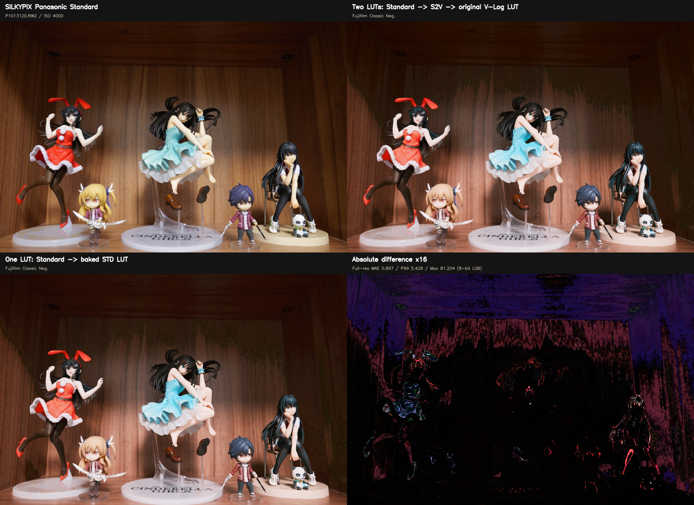
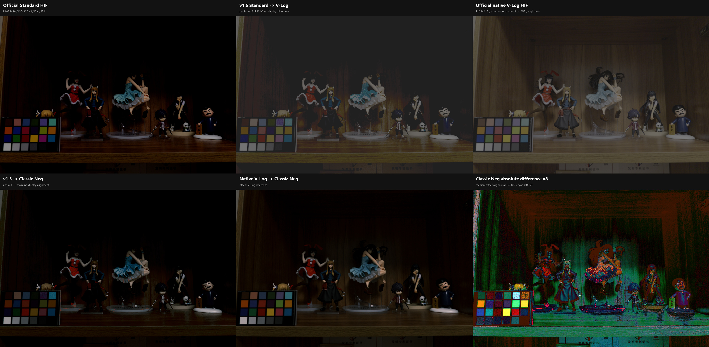

# 🧪 V-Log Alchemy (Lumix Body Snatcher)

[English](README.md) | [简体中文](README_zh-CN.md)

> 通过精确的色彩科学逆向工程，将松下 Lumix 相机（S1R II/S5M2 等）的色彩科学转换为富士 GFX、徕卡、哈苏 Phocus、ARRI 等顶级电影机/中画幅风格。

---

## 🔗 相关项目 (Related Projects)

### Raw-Alchemy
**[Raw-Alchemy](https://gitee.com/MinQ/Raw-Alchemy)** - 专门给 RAW 图片套 LUT 的工具。

如果你想将这些电影级 LUT 直接应用到 RAW 照片（DNG、CR2、ARW 等）而不需要通过视频编辑软件，可以试试 Raw-Alchemy。它专为处理 RAW 图像的 LUT 转换而设计，同时保留最大的图像质量。

---

## 📖 简介 (Introduction)

本项目旨在通过数学手段，打破相机品牌的“色彩壁垒”。

许多相机厂商（如 Fujifilm、Leica、Hasselblad）拥有极具特色的色彩科学（Color Science），但它们的官方 LUT 或渲染流程通常只接受自家相机的输入。本项目通过 **ACES (Academy Color Encoding System)** 流程以及已恢复的厂商渲染行为进行逆向工程：

1.  将 Panasonic **V-Log/V-Gamut** 转换到标准的 **ACES AP0 (Linear)**。
2.  使用自定义编写的 **DCTL (DaVinci Color Transform Language)** 或高精度转换矩阵，执行目标相机 IDT (Input Device Transform) 的**逆运算**。
3.  将信号伪装成目标相机的原生 Log/Gamut 或已恢复的内部 RGB 空间（如 F-Log2C、Leica Log、Hasselblad RGB）。
4.  应用目标厂商的官方色彩 LUT 或已恢复的渲染转换。

最终生成的 `.cube` 文件可直接导入松下相机（如 S1R II, S1H, S5系列）进行机内实时监看，或在后期流程中使用。

---

## 📂 文件列表与风格说明 (LUT Pack Content)

本仓库原有风格 LUT 专为 **Panasonic V-Log / V-Gamut** 输入设计。v1.3 新增按机型生成的 Panasonic Standard 输入适配。

### Panasonic Standard 输入（v1.3；v1.5 校正）

`Luts/Panasonic-Standard/Conversion` 包含 GH6、S5II/S5IIX、G9II、GH7、S9、S1IIE、S1RII、S1II 和 DC-L10 的 `Standard -> V-Log` 33 点转换 LUT。

由于所有适配器都以同一套固定的 V-Log/V-Gamut 为终点，保持中性轴的实测输出校正已对上述全部机型启用。S1RII 已完成受控定量验证，S9 有相同症状的实拍反馈；其余机型仍需补充对应的 Standard/原生 V-Log 配对验证。

支持双 LUT 的相机应在 My Photo Style 中使用：

```text
LUT1 = 对应机型的 *S2V.cube（Standard base）
LUT2 = 本仓库原有的 V-Log 风格 LUT
```

Panasonic 按 `LUT2(LUT1(image))` 串联应用两层。两层浓度先设为 100%，需要减弱风格时只降低 LUT2。单 LUT 使用场景可运行 `Tools/merge_standard_luts.py`，一次把一个或两个 V-Log LUT 转成对应机型的 Standard 版本。所有生成文件都在 `TITLE` 后立即包含 `#LUMIXPHOTOSTYLE STD`。

机型、固件要求、双 LUT 设置、生成依据和不可恢复的 Standard 高光/色域限制见 [`Luts/Panasonic-Standard/README_zh-CN.md`](Luts/Panasonic-Standard/README_zh-CN.md)。

### 🗻 Fujifilm GFX Series (F-Log2C Core)
*基于富士中画幅色彩科学，高像素机型（如 S1R II）的绝配。*

*   **`FLog2C_to_REALA-ACE_VLog.cube`**
    *   **风格**: Reala Ace (GFX100 II 首发)。
    *   **特点**: 色彩还原极其精准，硬朗且通透，非常适合风景、建筑和高解析力拍摄。
*   **`FLog2C_to_CLASSIC-CHROME_VLog.cube`**
    *   **风格**: Classic Chrome (经典正片)。
    *   **特点**: 低饱和度，强对比度，模仿老式纪实杂志风格。
*   **`FLog2C_to_CLASSIC-Neg._VLog.cube`**
    *   **风格**: Classic Neg (经典负片)。
    *   **特点**: 街拍神级色彩，高对比，红橘色偏暖，强调硬调。
*   **`FLog2C_to_PROVIA_VLog.cube`**
    *   **风格**: Provia (标准)。
    *   **特点**: 标准、万能、肤色自然。
*   **`FLog2C_to_Velvia_VLog.cube`**
    *   **风格**: Velvia (鲜艳)。
    *   **特点**: 极高饱和度，风景专用。
*   **`FLog2C_to_ASTIA_VLog.cube`**
    *   **风格**: Astia (柔和)。
    *   **特点**: 柔和的肤色表现，适合人像。
*   **`FLog2C_to_ETERNA_VLog.cube`**
    *   **风格**: Eterna (电影)。
    *   **特点**: 超低对比度，柔和的高光滚降，适合视频基底。
*   **`FLog2C_to_ETERNA-BB_VLog.cube`**
    *   **风格**: Eterna Bleach Bypass (跳漂)。
    *   **特点**: 低饱和，极高对比，冷峻金属感。
*   **`FLog2C_to_PRO-Neg.Std_VLog.cube`**
    *   **风格**: Pro Neg. Std。
    *   **特点**: 影棚人像标准，细腻平滑。
*   **`FLog2C_to_ACROS_VLog.cube`**
    *   **风格**: Acros。
    *   **特点**: 质感极佳的黑白模式，有着独特的中灰影调。

### 🔧 基础转换 (Technical)
*   **`FLog2C_to_FLog2C-709_VLog.cube`**
    *   **风格**: Rec.709 Tech Transform。
    *   **特点**: 纯技术转换，将 F-Log2C 还原为标准 Rec.709，不带任何胶片风格。
*   **`FLog2C_to_WDR_VLog.cube`**
    *   **风格**: Wide Dynamic Range (宽动态范围)。
    *   **特点**: 富士特色的视频直出曲线。比标准 Rec.709 保留更多高光和阴影细节，反差适中，色彩自然，适合快速出片或直播。

---

### 🔴 Leica (L-Log Core)
*基于 Leica SL/Q 系列色彩科学，提供极具辨识度的“德味”厚重感。*

*   **`L-Log_to_Classic_VLog.cube`**
    *   **风格**: Leica Classic (经典)。
    *   **特点**: 标志性的“徕卡味”。高微反差 (Micro-contrast)，深沉的暗部，锐利且略带冷调的阴影，暖调的高光。非常适合黑白摄影预视或强调质感的纪实摄影。
*   **`L-Log_to_Natural_VLog.cube`**
    *   **风格**: Leica Natural (自然)。
    *   **特点**: 相比 Classic 更加现代和中性。保留了徕卡的高光滚降特性，但暗部细节更多，对比度更温和，色彩过渡非常平滑“高级”，适合时尚、人像或日常记录。

---

### 🟧 Hasselblad Phocus (Phocus X2D Core)
*基于 Hasselblad Phocus 4.0.1 X2D 已恢复的渲染路径（含日光色彩校正阶段）。v1.4 以可直接使用的 Rec.709 和 sRGB 输出替换原 Hasselblad RGB/D50 中间域文件。*

*   **`Hasselblad_Standard_Phocus_X2D_VLog_Rec709.cube` / `..._sRGB.cube`**
    *   **风格**: Hasselblad Standard，包含实测日光 Phocus `ColorCorrect` CbCr 阶段、高光滚降和 Standard film curve。
*   **`Hasselblad_Nature_Phocus_X2D_VLog_Rec709.cube` / `..._sRGB.cube`**
    *   **风格**: Hasselblad Nature，在 Standard 基础上叠加实测 Nature RGB gradation table，户外和高饱和色响应更饱满。
*   **输出选择**: 相机监看/视频使用 Rec.709，sRGB 管理的照片和桌面流程使用 sRGB；两者都是完整显示变换，无需后续 CST。
*   **65 点版本**: Standard/Nature 与 Rec.709/sRGB 的全部组合均提供 65 点版本。
*   **日光烘焙**: Phocus `ColorCorrect` / CbCr 阶段会随白平衡变化。发布的 LUT 和仓库内 artifact 使用日光表（同时覆盖阴天/阴影区间）。仓库未包含钨丝灯和暖光捕获；如已另行准备对应的 artifact bundle，可通过 `--artifact` 选择。
*   **移除旧版**: v1.4 前的 Hasselblad RGB/D50 中间域 LUT 不适合普通用户直接使用，现已从主版本移除；仍可从 `v1.3` 标签获取，且不能把它们当作 ACES AP1。
*   **不单独发布**: `Portrait` 和 `Product`，因为实测颜色转换与 `Standard` 一致；它们在 Phocus 里的差异主要是 3D LUT 无法编码的锐化/降噪行为。

风格参考：[Hasselblad Natural Colour Solution](https://www.hasselblad.com/learn/hasselblad-natural-colour-solution/)。恢复出的处理路径见 [`Luts/Hasselblad/README.md`](Luts/Hasselblad/README.md)。

---

### 📷 Nikon (N-Log Core)
*基于尼康的 N-Log 色彩科学，为色彩分级提供了一个通用的起点。*

*   **`N-Log_BT2020_to_REC709_BT1886_VLog.cube`**
    *   **风格**: 尼康官方 Rec.709。
    *   **特点**: 尼康从 N-Log 到 Rec.709 的标准转换，提供中性、准确的色彩表现。
*   **`RED_Achromic_Rec2020_N-Log_to_Rec709_VLog.cube`**
    *   **风格**: RED Achromic。
    *   **特点**: 以低对比度的单色外观转换素材。非常适合营造细节丰富的柔和艺术感。
*   **`RED_FilmBias_Rec2020_N-Log_to_Rec709_BT1886_VLog.cube`**
    *   **风格**: RED Film Bias。
    *   **特点**: 增添了传统胶片的金色温暖和色调。是打造有机、电影感并能增强肤色的起点。
*   **`RED_FilmBiasBleachBypass_Rec2020_N-Log_to_Rec709_BT1886_VLog.cube`**
    *   **风格**: RED Film Bias Bleach Bypass。
    *   **特点**: 模拟跳漂白工艺的高对比度和去饱和色彩。提供一种戏剧性的、褪色的外观，赋予画面一种严酷的现实主义。
*   **`RED_FilmBiasOffset_Rec2020_N-Log_to_Rec709_BT1886_VLog.cube`**
    *   **风格**: RED Film Bias Offset。
    *   **特点**: 通过独特的分割色调偏移和微妙的温暖感，再现复古胶片外观。非常适合艺术场景和风景。

---

### 🎬 ARRI (LogC Core)
*基于 ARRI Alexa 电影机的色彩科学，提供行业标准的电影感。*

*   **`ARRI_LogC2Video_Classic709_VLog.cube`**
    *   **风格**: ARRI Classic 709。
    *   **特点**: 经典的 ARRI Rec.709 外观，被无数电影和电视剧使用。色彩真实，肤色表现出色，高光过渡自然。

---

### 🎞️ Film Emulation (Cineon Core)
*基于柯达 Cineon 扫描系统，模拟经典电影胶片的色彩。*

*   **`Cineon_to_Fuji_3513DI_D65_VLog.cube`**
    *   **风格**: Fuji 3513DI Print Film。
    *   **特点**: 模拟富士电影发行拷贝的色彩，具有标志性的青色和柔和的对比度。
*   **`Cineon_to_Kodak_2383_D65_VLog.cube`**
    *   **风格**: Kodak 2383 Print Film。
    *   **特点**: 模拟柯达电影发行拷贝的色彩，是好莱坞大片的标准外观，色彩温暖，对比度较高。

---

### 🎥 RED Digital Cinema (RED IPP2 Core)
*基于 RED 数字电影机的 IPP2 图像处理流程。*

*   **`REC709_MEDIUM_CONTRAST_Soft_VLog.cube`**
    *   **风格**: RED IPP2 Medium Contrast / Soft Highlight。
    *   **特点**: RED 官方 Rec.709 转换之一，提供中等对比度和柔和的高光滚降，适合各种场景。

---

## 📺 社区作品展示 (Community Showcase)

这是使用 **V-Log Alchemy** 完成的对比视频 (富士 X100V vs. Lumix S5IIX)。

特别感谢来自 **[DIE LICHTFÆNGER ACADEMY](https://www.youtube.com/@dielichtfaenger_academy)** 的 **Josef** 测试并提供了这段素材！

[](https://youtu.be/LX-2BNarGq4)

---

## 📸 样片展示 (Sample Images)

以下是一些展示 LUT 效果的样片图片：

### 富士 Classic Neg. LUT


### 徕卡 Classic LUT


### Panasonic Standard 输入 / 双 LUT 合并

同一 Standard TIFF 的双 LUT 链与单个合并 LUT 对比：



相同设置下的 S1RII Standard 与原生 V-Log 受控对照：



Fujifilm、Leica 对照和全分辨率误差报告见 [`Samples/Panasonic-Standard/README_zh-CN.md`](Samples/Panasonic-Standard/README_zh-CN.md)。

---

## 🛠️ 使用方法 (Usage)

### 1. 简易方式 (相机 / 实时 LUT)
仓库中已包含预先生成的 33 点 Cube LUT。

1.  下载 `.cube` 文件。
2.  将它们复制到相机的 SD 卡中（或使用 Lumix Lab App）。
3.  将它们加载到 LUT 库中。
4.  即可直接拍摄带有所选风格的 JPEG 或视频。

### 2. 标准方式 (DaVinci Resolve 免费版)
适用于没有 Studio 版本、希望在后期制作中应用风格的用户：

1.  将提供的 `.cube` 文件导入 DaVinci Resolve。
2.  工作流程: V-Log -> 校色节点 (Corrector)。
3.  将您想要的 LUT 拖放到校色节点上。

> **注意**: 此工作流程比 Studio 版本更简单，但精度略低，因为它依赖于标准的 33 点 LUT 而非 DCTL 的数学计算。

### 3. 专业方式 (DaVinci Resolve Studio)
如果您希望在后期制作中获得完全控制：

1.  使用提供的 `.dctl` 文件。
2.  工作流程: V-Log -> [CST 至 ACES (AP0), 线性] -> [我的 DCTL] -> [目标 LUT]；对于哈苏 Phocus 这类非 ACES 路径，也可以直接使用仓库中生成好的 `.cube` 文件。
3.  在色彩空间转换 (CST) 节点上禁用 **色调映射 (Tone Mapping)** 和 **白点自适应 (White Point Adaptation)**。

这样您就可以在拍摄后灵活地更换风格。

> **注意**: DCTL 是 DaVinci Resolve Studio 付费版独有的功能。

### 4. Adobe Camera RAW / Lightroom 用户 (实验性)

如果你能容忍一部分色差的话，你可以在Adobe Camera RAW导入的时候，选择“配置文件 (Profile)” > “机型匹配 (Camera Matching)”中的V-Log预设，然后再应用本仓库的`.cube`文件。

这样做的色彩会有一点偏差但不会太大，后期可以自己再调整一下。这是一种“权宜之计”，因为ACR/LR对视频LUT的支持不如视频剪辑软件原生。

---

## 🧮 核心算法 (The Math)

本项目的核心在于精确的逆运算矩阵。以 **ACES AP0 to F-Log2C** 为例，我们计算了富士官方 IDT 的逆矩阵：

```c
// ACES AP0 (Linear) to F-Gamut (Linear) Inverse Matrix
// Calculated based on Fujifilm F-Log2C official IDT v1.00
{
     1.18805632080277f, -0.0526707998586238f, -0.135385520944148f,
     0.000717966415014435f, 0.987967895093181f, 0.0113141384918043f,
     0.0095814146658757f, 0.00504068380666559f, 0.985377901527459f,
};
```

详细的 DCTL 代码请查看 `DCTL` 文件夹。

Hasselblad Phocus LUT 使用已恢复路径（含日光色彩校正阶段）：

```text
V-Log / V-Gamut
  -> linear V-Gamut
  -> XYZ D65
  -> Bradford D50 adaptation
  -> Hasselblad RGB
  -> Phocus daylight CbCr ColorCorrect
  -> highlight rolloff
  -> Phocus Standard film curve
  -> optional Phocus style gradation
  -> explicit Rec.709 or sRGB display conversion
```

这条路径由 [`Tools/generate_hasselblad_vlog.py`](Tools/generate_hasselblad_vlog.py) 生成。
这里对哈苏风格的描述遵循 HNCS 对准确色彩、平滑明暗/色彩过渡、肤色连续性、胶片式对比，以及从拍摄到 Phocus 后期一致性的强调。
Phocus `ColorCorrect` / CbCr 阶段会随白平衡变化；发布的 LUT 烘焙进仓库内的日光表（同时覆盖阴天/阴影）。若要使用其他实测表，需要另行准备 manifest bundle 并通过 `--artifact` 选择。
生成器及其经过 SHA-256 校验的数值资产均已包含在仓库中，只使用相对路径。默认 `rec709` 模式执行 Hasselblad RGB ICC TRC 解码、Bradford D50 到 D65 适配、BT.709 原色转换和 BT.709 OETF；`--output-space srgb` 使用同一组 D65 原色和 sRGB 传递函数。`hasselblad-rgb` 仍作为名称明确的高级中间域模式保留，但不再发布为普通用户 LUT。这些是定义明确的色度转换，并不声称能精确复现尚未恢复的 Phocus 导出色域映射。准确输出约定和干净检出命令见 [`Luts/Hasselblad/README.md`](Luts/Hasselblad/README.md)。

---

## ⚠️ 注意事项 (Disclaimer)
1. **物理限制**：虽然我们在数学上对齐了色彩空间，但不同传感器的 CFA (色彩滤镜阵列) 光谱响应特性不同。所谓的"同色异谱"现象意味着在某些极端光源下（如霓虹灯），松下的表现可能仍与原机有细微差异。
2. **非官方**：本项目与 Panasonic、Fujifilm、Leica、Hasselblad、ARRI、Nikon、RED 以及其他提及的相机厂商无官方关联。
